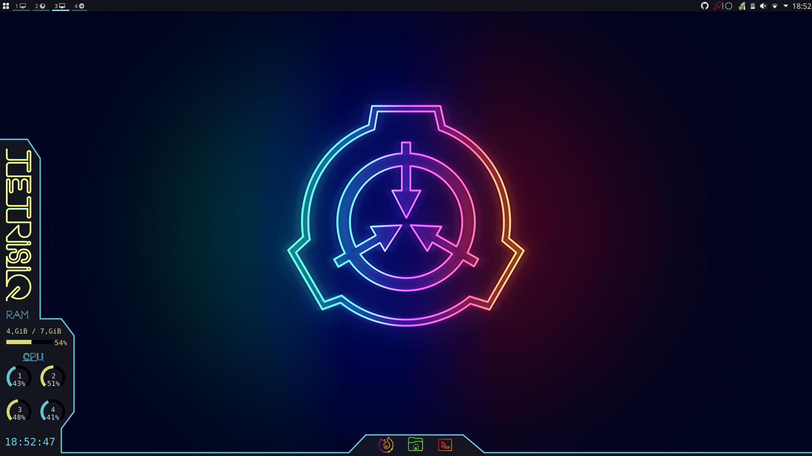

# My i3-gaps/KDE Dotfiles

Here are my currently i3-gaps/KDE Dotfiles with
- Conky (Lua)
- Neon Font
- [Neon icons](https://store.kde.org/p/1358970)
- [Global Themes](https://store.kde.org/p/1355746)

__I hope I have put all dots in here.__  

If I missed some feel free to ask me. 
  
### For my BSPWM dotfiles switch to [this](https://github.com/TetrisIQ/dotfile/tree/2019-setup) Branch.  
